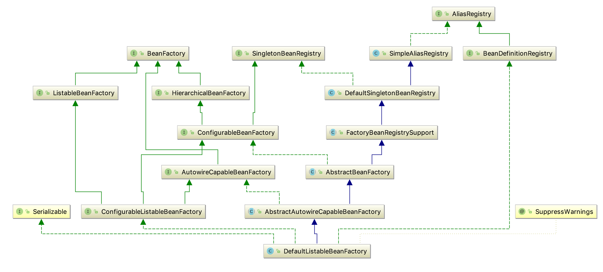
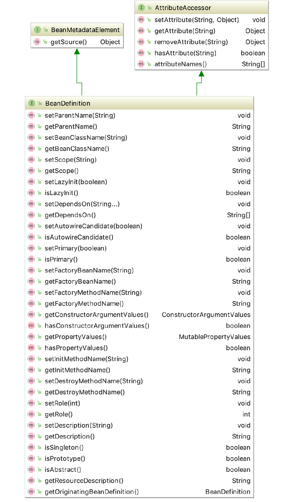
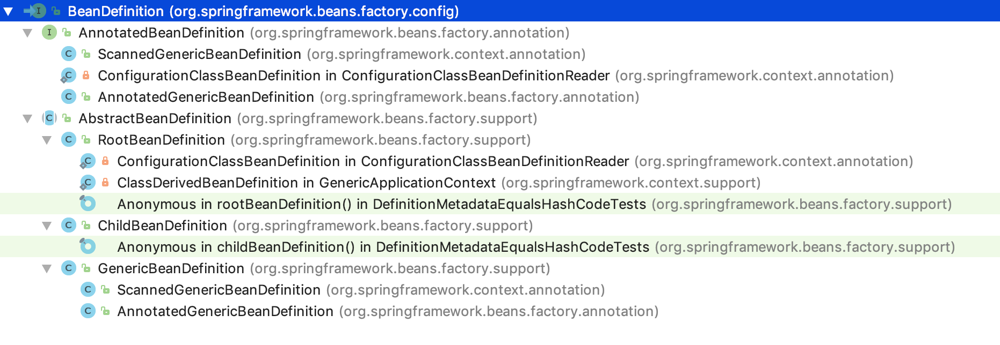

# Spring-Core模块


# 容器的基本实现

## 2.1 容器的基本用法

&emsp;&emsp;容器作为Spring框架中最为主要的东西，类似于一个大的集装箱，所有的对象都可以往这个集装箱中装。对于一个JavaBean来说就是这个集装
箱中所要装的东西所以说如果只有东西但是没有装东西的地方这样的话对于对象来说就没有任何的意义了。

&emsp;&emsp;正如之前上面的例子一样在com.core.charp2.demo01.bean包中创建了两个对象和一个接口。从这个上面来看这类与普通的Java类没有什么
区别，但是如果使用了Spring框架之后就可以让这个类变成真正意义上的POJO。这就是通过Spring的配置文件来实现的。也就是bean.xml文件中所配置的内
容一样。通过代码中的例子是可以看出来效果的。

## 2.2 功能分析
 
&emsp;&emsp;上面的例子从简单的角度上讲无非实现了三个功能

* 1、通过对于配置文件bean.xml的读取和验证获取到对象的创建信息
* 2、获取到对象信息，通过反射机制进行序列化操作
* 3、将所有的应用逻辑进行串联操作

## 2.3 项目体验

## 2.4 Spring的组成结构


&emsp;&emsp;通过上图可以看到在其中有一个比较重要的类就是ResourceLoader类，这个类提供了策略模式。通过实现这个接口进而实现接口中的方法，
实现不同的获取Resource的方法。


&emsp;&emsp;对于环境变量获取主要有两个方面的内容，一个方面是通过JVM固定参数的形式，一个方面是通过配置文件的方式。这里的Environment就是对
着两个方面的配置通过这两个方面的配置来达到灵活配置的目的，但是更多的或者是更重要的是通过配置文件的方式进行配置。

### 2.4.1 核心类介绍



**1、DefaultListableBeanFactory**

&emsp;&emsp;从上面类图中可以看到对于XmlBeanFactory类来讲，它就是继承了DefaultListableBeanFactory类来实现的，而DefaultListableBea
nFactory类作为整个Spring注册以及加载的核心部分而存在。在很多的地方由于找不到对应的Bean而报错的时候就是由这个类的异常捕获机制来进行处理的。
所以在整个类加载的过程中，它的作用是非常重要的。

&emsp;&emsp;其实在上面类图中可以看到很多的类，下面就来简单的说明一下各个类的作用

* AliasRegistry 接口 主要是定义了对于alias的增删改查操作。
* SimpleAliasRegistry 接口实现类 主要作用是实现了上面AliasRegistry接口中的方法，并且对于alias做缓存操作。
* SingletonBeanRegistry 接口 定义了对单例的Bean的获取操作
* BeanFactory 接口 定义如何获取Bean以及Bean的各种属性
* DefaultSingletonBeanRegistry 接口实现类 对于SingletonBeanRegistry接口的实现
* HierarchicalBeanFactory 接口 对于BeanFactory接口的扩展，在BeanFactory的基础上增加了对parentFactory的支持操作
* BeanDefinitionRegistry 定义对BeanDefinition的各种增删改查操作
* FactoryBeanRegistrySupport 在DefaultSingletonBeanRegistry的基础上增加的了对FactoryBean的特殊功能的处理
* ConfigurableBeanFactory 提供了配置Factory的各种实现方法
* ListableBeanFactory 根据各种条件获取Bean的配置清单
* AbstractBeanFactory 综合实现了FactoryBeanRegistrySupport类 ，ConfigurableBeanFactory接口的功能
* AutowireCapableBeanFactory 提供创建Bean、自动注入、初始化以及应用Bean的后处理器
* AbstractAutowireCapableBeanFactory 综合AbstractBeanFactory、AutowireCapableBeanFactory两个姐的方法并提供实现
* ConfigurableListableBeanFactory BeanFactory配置清单，指定忽略类型及接口等
* DefaultListableBeanFactory 综合实现上面内容的所有功能

&emsp;&emsp;通过上面的分析可以知道所有的关于Bean的操作都是由BeanDefinition来进行操作的，那么BeanDefinition到底是个什么东西呢？下面就
来升入的了解一下关于BeanDefinition的内容。

org.springframework.beans.factory.config.BeanDefinition 进入到这个类中会发现其实这个类是一个接口。并且这个类还实现了继承了两个接口
```
public interface BeanDefinition extends AttributeAccessor, BeanMetadataElement
```


&emsp;&emsp;那么既然这个类作为一个接口存在那么到底是谁去实现这个接口呢？


通过上面这张图，可以知道其中有一个AbstractBeanDefinition抽象类，这个抽象类有两个子类RootBeanDefinition、ChildBeanDefinition。当然
实际上它有三个实现类，这里最为重要的就是这两个类。
**2、XmlBeanDefinition**

 


