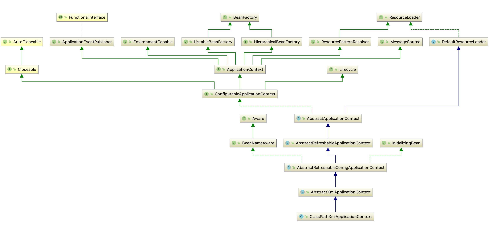
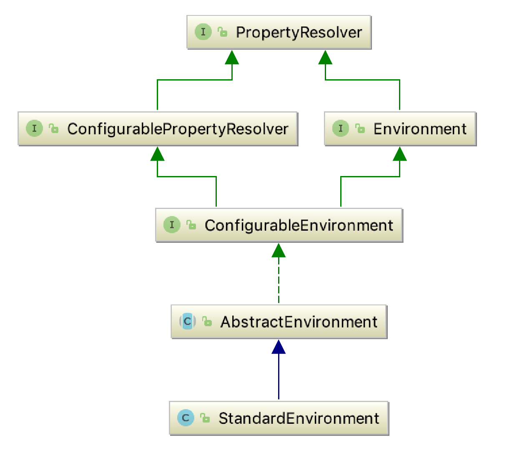

# Spring-Core模块



&emsp;&emsp;通过上图可以看到在其中有一个比较重要的类就是ResourceLoader类，这个类提供了策略模式。通过实现这个接口进而实现接口中的方法，
实现不同的获取Resource的方法。


```
public ClassPathXmlApplicationContext(String[] configLocations, boolean refresh, @Nullable ApplicationContext parent)
	throws BeansException {
     super(parent);
     setConfigLocations(configLocations);
     if (refresh) {
     	refresh();
     }
}
```

```java 
public AbstractApplicationContext(@Nullable ApplicationContext parent) {
  this();
  setParent(parent);
}


public AbstractApplicationContext() {
  this.resourcePatternResolver = getResourcePatternResolver();
}


protected ResourcePatternResolver getResourcePatternResolver() {
   return new PathMatchingResourcePatternResolver(this);
}
```


&emsp;&emsp;对于环境变量获取主要有两个方面的内容，一个方面是通过JVM固定参数的形式，一个方面是通过配置文件的方式。这里的Environment就是对着两个方面的配置
通过这两个方面的配置来达到灵活配置的目的，但是更多的或者是更重要的是通过配置文件的方式进行配置。